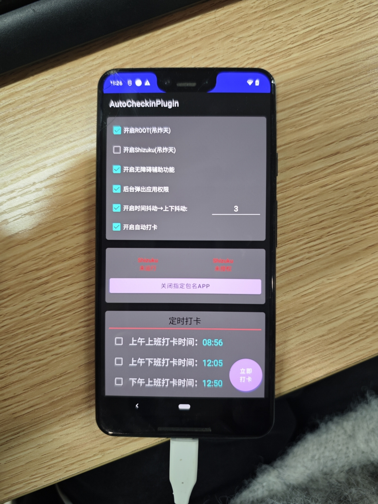

# 企业微信自动打卡

## 项目介绍
将手机放在公司，每天自动打卡，不用每天都带着手机去公司了。

## 群聊

群号： 937814754

## 预览


## ROOT优化
- [x] 优化无障碍服务，root情况下，不需要每次都开启无障碍服务
- [x] 优化无障碍服务，shizuku情况下，不需要每次都开启无障碍服务
- [x] 优化屏幕状态，自动完成开屏和息屏(需要ROOT或者Shizuku(免root))
- [x] 时间抖动功能，不在固定的时间，而是会有秒或者分的抖动，增加随机性

## 继续优化
- [ ] 增加日历功能，可以选择哪一天打卡，增加每日进度条，每完成一次进度条增加一格


## 部分技术

### ROOT权限或Shizuku下开启无障碍服务
```shell
# 获取无障碍服务列表 拿到cn.martinkay.autocheckinplugin/cn.martinkay.autocheckinplugin.service.MyAccessibilityService
adb shell settings get secure enabled_accessibility_services
```

```shell
adb shell settings put secure enabled_accessibility_services cn.martinkay.autocheckinplugin/cn.martinkay.autocheckinplugin.service.MyAccessibilityService
```

```shell
adb shell settings put secure accessibility_enabled 1
```
