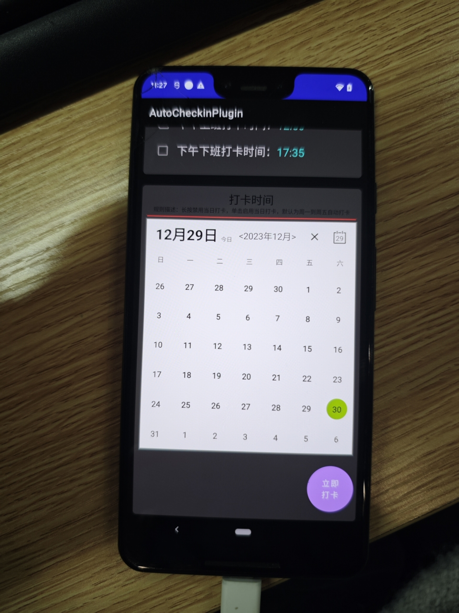

# 企业微信自动打卡

## 项目介绍
将手机放在公司，每天自动打卡，不用每天都带着手机去公司了。

## 群聊

群号： 937814754

## 预览




## 全新功能预览


## 全新功能说明
- [x] 支持通知保活，一些有杀后台的系统也可以保证后台存活
- [x] 支持兼容不同版本的企微，只需要设置好id即可
- [x] 支持邮箱通知，如：查询电量、签到状态的邮件通知
- [x] 支持消息监听QQ\TIM\支付宝\微信 远程控制 如 电量、签到 等基础指令
- [x] 支持超级指令 设置时间段是否开启、设置邮箱、重载配置、关闭程序

## ROOT优化
- [x] 优化无障碍服务，root情况下，不需要每次都开启无障碍服务
- [x] 优化无障碍服务，shizuku情况下，不需要每次都开启无障碍服务
- [x] 优化屏幕状态，自动完成开屏和息屏(需要ROOT或者Shizuku(免root))
- [x] 时间抖动功能，不在固定的时间，而是会有秒或者分的抖动，增加随机性
- [x] 增加日历功能，可以选择哪一天打卡

## 防检测优化
- [x] 增加生成随机包名功能，在下载原版程序后，在程序内生成全新的包名，防止针对性检测插件的原版包名

## 继续优化
- [ ] 增加控制端，支持远程关闭自动签到，适用于突发请假的情况。


## 部分技术

### ROOT权限或Shizuku下开启无障碍服务
```shell
# 获取无障碍服务列表 拿到cn.martinkay.autocheckinplugin/cn.martinkay.checkin.service.MyAccessibilityService
adb shell settings get secure enabled_accessibility_services
```

```shell
adb shell settings put secure enabled_accessibility_services cn.martinkay.autocheckinplugin/cn.martinkay.checkin.service.MyAccessibilityService
```

```shell
adb shell settings put secure accessibility_enabled 1
```


## 构建
Shizuku使用Android中的隐藏api。为了避免反射，使用一个特殊的SDK JAR来直接访问这些api。要成功构建，您需要从[这里](https://github.com/Reginer/aosp-android-jar)获取Android 14 (API 34) JAR，并按照说明安装它。


